# Bark Avenue Grooming

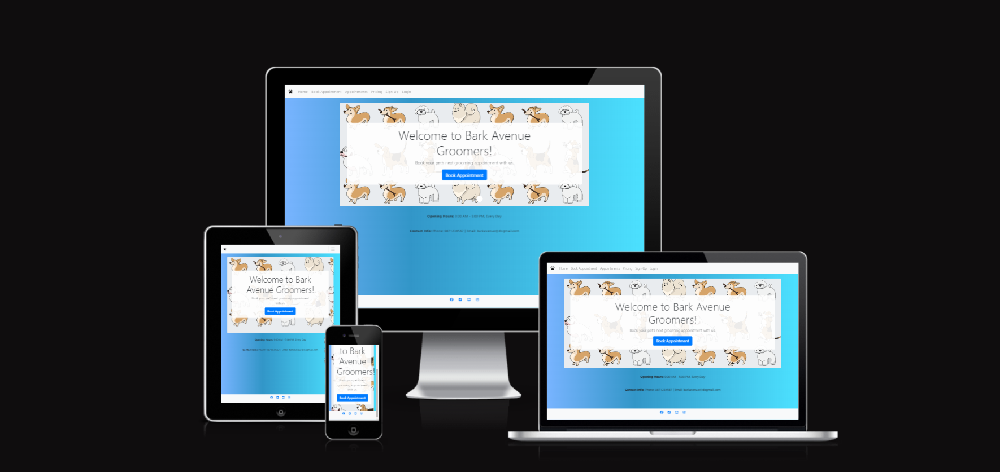

I decided to create a booking site for Bark Avenue Grooming because I wanted to challenge myself and step out of my comfort zone. The walkthroughs we had in the course were a blog post and a simple to-do list, so I didn't want to completely replicate them. I did take elements from both, though; the blog post walkthrough was particularly helpful for setting up this project. However, I aimed for this site to be mostly my own. Interestingly, my mom actually runs a grooming business by the same name, so I leaned on her for help with some of the smaller details. In this README, I'll delve into the full process of creating this site and discuss possible features I may want to add in the future.

View the deployed website [here](https://bark-avenue1-9df2e78c0c7f.herokuapp.com/).

## Table of Contents

1. [User Experience (UX)](#user-experience-ux)
    1. [Project Goals](#project-goals)
    2. [User Goals](#user-goals)
    3. [Goals Table](#goals-table)
    4. [Color Scheme](#color-Scheme)
    5. [Wireframes](#wireframes)
    6. [User Stories](#user-stories)
2. [Features](#features)
    1. [General](#general)
    2. [Home Page](#home-page)
    3. [Booking](#booking-page)
    4. [Appointments](#Appointments)
    5. [login](#login)
    6. [pricing](#pricing)
3. [Technologies Used](#technologies-used)
    1. [Languages Used](#languages-used)
    2. [Libraries and Frameworks](#languages-and-frameworks)
    3. [Packages / Dependencies Installed](#packages--dependencies-installed)
    4. [Tools and Programs](#tools-and-programs)
4. [Testing](#testing)
    1. [Lighthouse](#Lighthouse)
    2. [Code Validation](#Code-Validtion)
    3. [Manual Testing](#Manual-testing)
    4. [Bugs](#bugs)
5. [Deployment](#deployment)
6. [Finished Product](#finished-product)
7. [Credits](#credits)
8. [Acknowledgements](#acknowledgements)

## User Experience (UX)

#### Project Goals

- The website contains simple colours for a clean look and also to not draw attention from the content.

- Responsive design to make the website accessible on different screen sizes.

- Easy to read understand and navigate the site.

- Make it easy for users to sign up or login into the site.

- Have a simple booking form that sends the results to the database I setup.

- A page to view , edit and delete appointments. (CRUD)

***

#### User Goals

- As an Admin, I want to manage the site content.

- As a User, I want the information to be easy to find and read.

- As a User, I want to be able to book an appointment.

- As a User, I want to be able to view , edit and delete my appointments.

- As a User, I want to see the prices of the available services.

***

#### Goals Table

Goal | Achieved? |
--- | --- | 
User sign up/login| Yes |
Make an appointment | Yes  |
View and edit appointments |Yes |
Avoid double bookings for groomers | Yes |
Contact details / social links | Yes |
View prices | Yes |
Have a responsive design |  Yes |

***

### Color Scheme

For my previous web pages I had something to take the color from that had to do with the theme.
This time there's no history involved I tried to keep it simple Black and White with a splash of Color.
And I chose the light blue as the splash because it's my mom's favourite color and she inspired this site.

***

### Wireframes

For my wireframes i used to use balsamiq but my free trail actually ran out, so this time around I'm using [Figma](https://www.figma.com/),
It's not what I'm used to but it still gave me the help I needed to visually plan out most of this project.

Page | Wireframe
--- | --- 
Home | 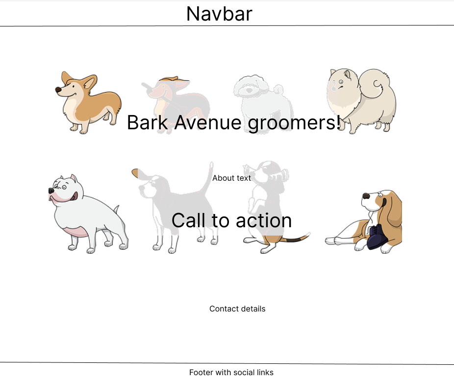 |
Booking| 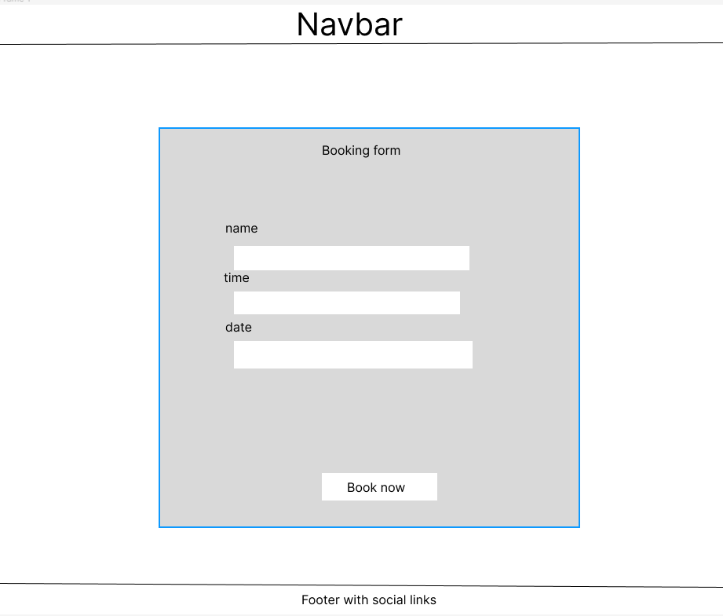 |
Login / Logout | 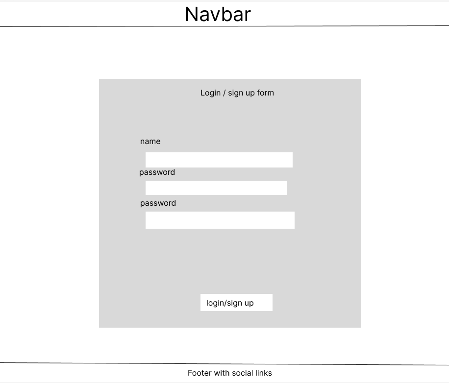 |
Appointments | 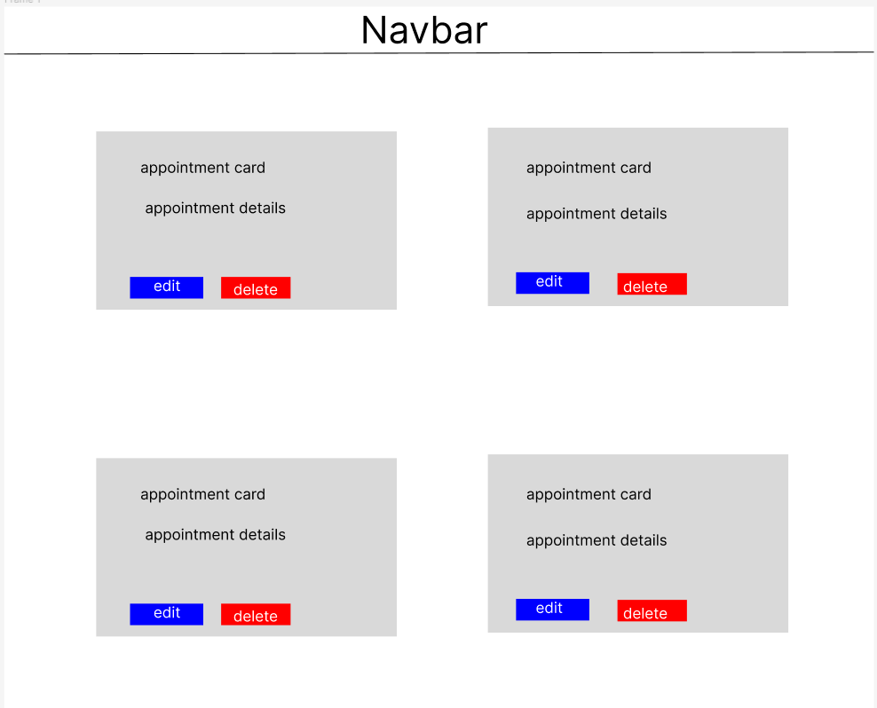 |

[Back to top ⇧](#Bark-Avenue-Grooming)

***

### User Stories

- Github projects was used to track my user stories, I found this as a helpful way of tracking my own progress.

- Stage 1

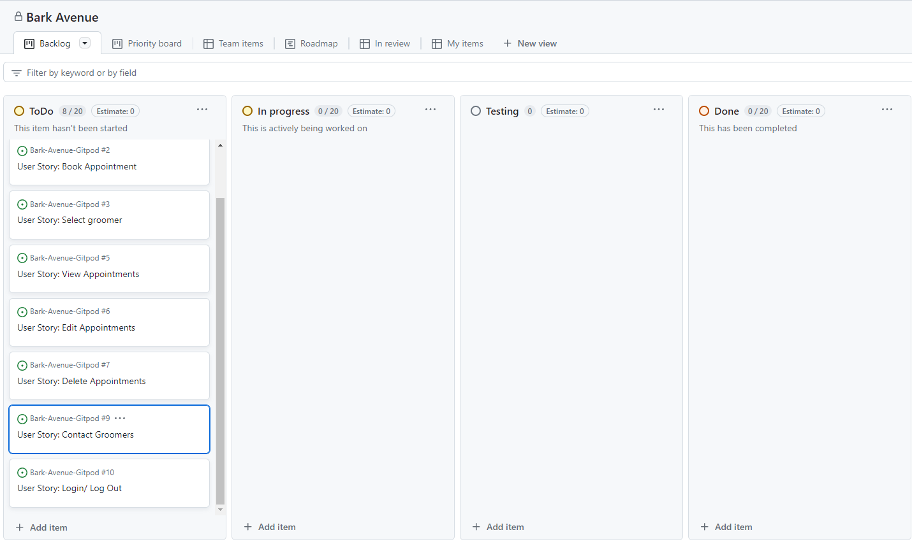

- Stage 2

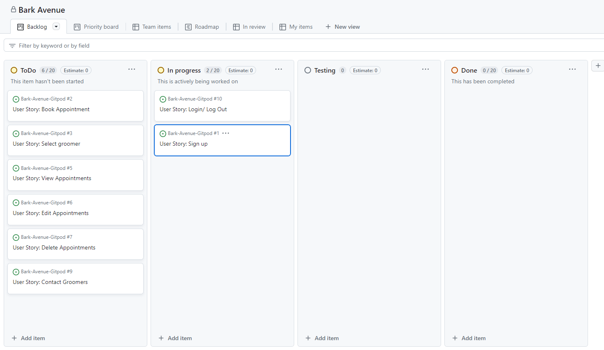

- Stage 3

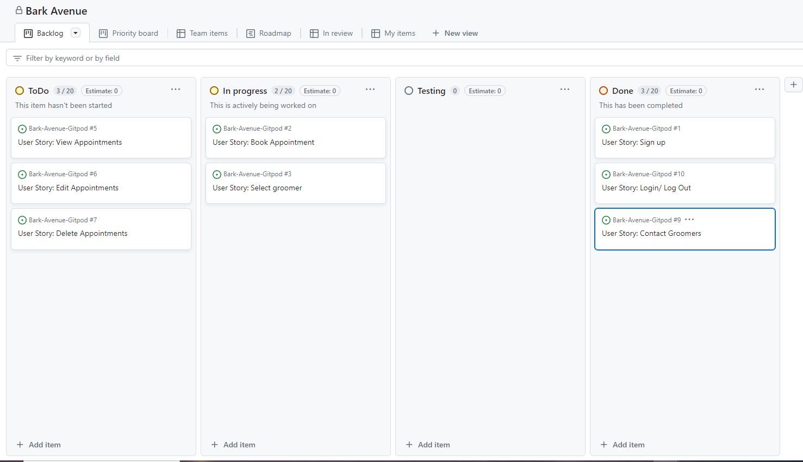

- Stage 4

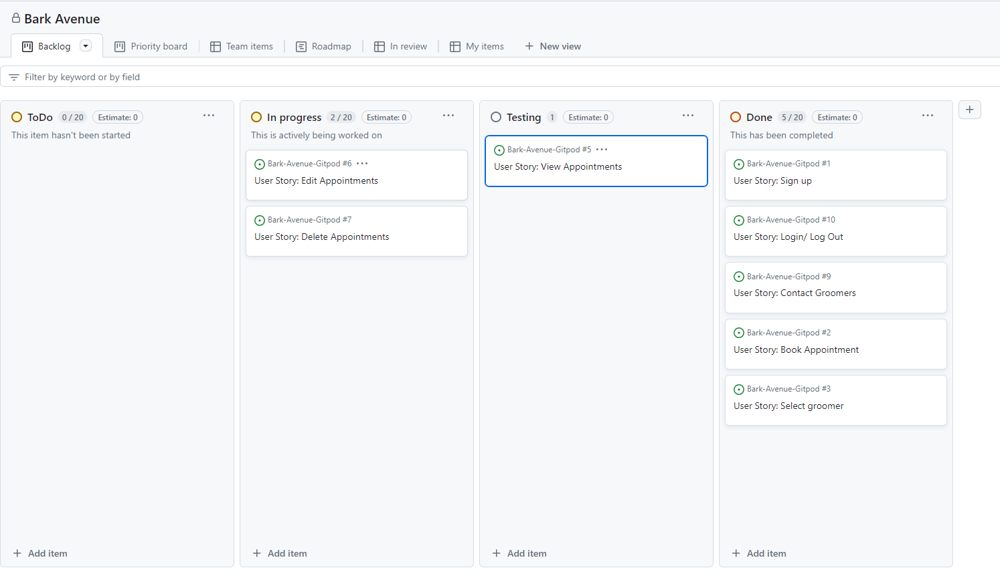

- Stage 5

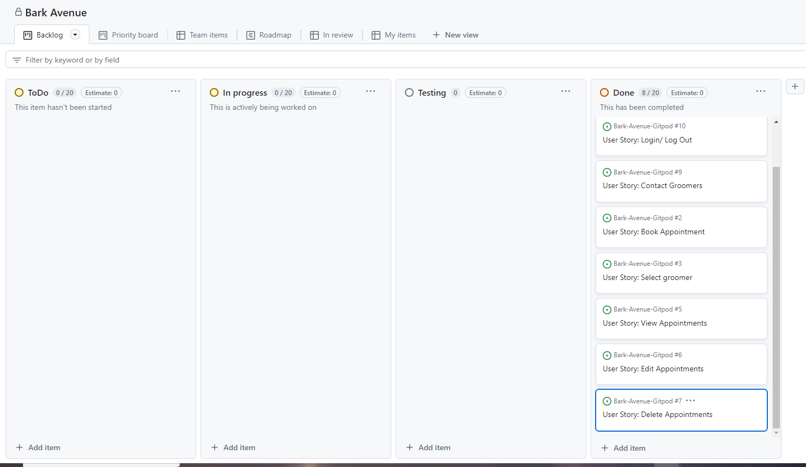

## Features

### General

### Navbar

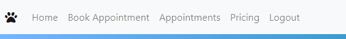
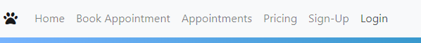

- I used a simple navbar for this project just basic white background with simple text and the companys logo.

- I mostly just wanted the navbar to be responsive at all screen sizes.

- So I used Bootstrap to make this navbar, at smaller screens it turns the links into a hamburger icon for ease of use and a cleaner design.

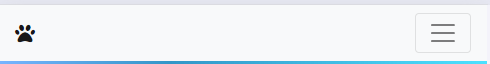
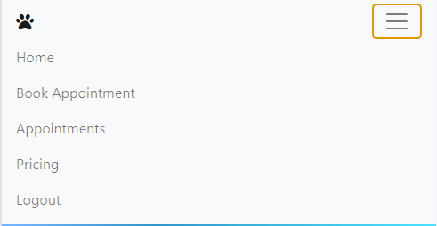

[Back to top ⇧](#Bark-Avenue-Grooming)

***

### Call to action

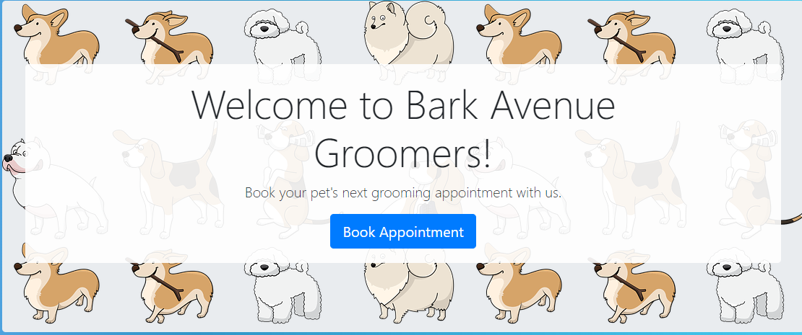

- Again the design for this is pretty simple, it has a clear function. It tells the user the name of the company and gives them a button to where they can go straight to the booking form.

- I added the background image to make the home page seem a bit more fun and add some life to it.

***

### Footer

- The footer of this site just contains the social media links, when the user hovers over said icon it changes color to a color associated with that site.

***

### Home Page

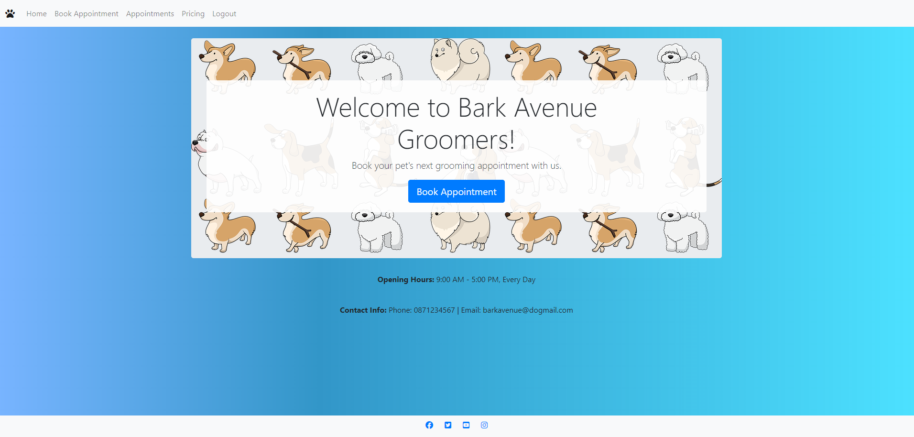

- The main goal of my home page is to tell the customer what we are about and give them an easy way to make a booking.

- I also added the contact details here in case some users just want the phone number and don't want to sign in.

***

### Booking Page

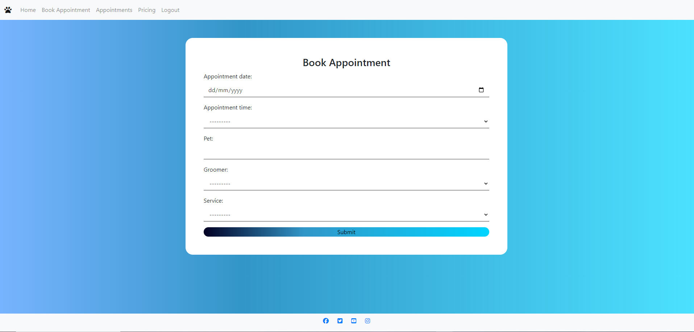

- My booking page contains a form I made with bootstrap, I wanted it to be a simple form that's responsive.

- Once the form is completed it sends the user to the appointments page.

***

### Appointments

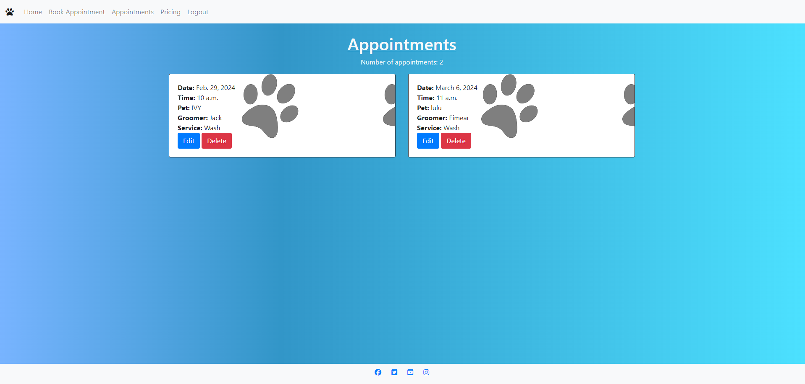

- My appointments page contains cards with the appointment details on it.

- The cards also contain an edit and delete buttons and a background design.

***

### Login 

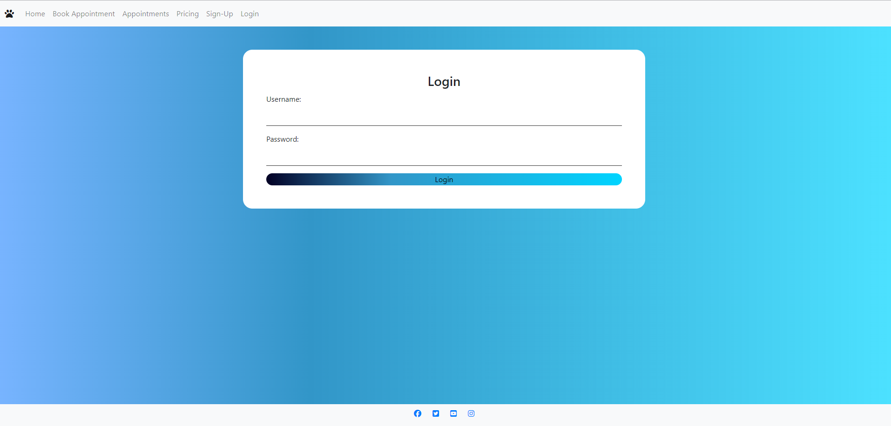

- My login page is again very simple , but serves my goal of being responsive and straight to the point.

***

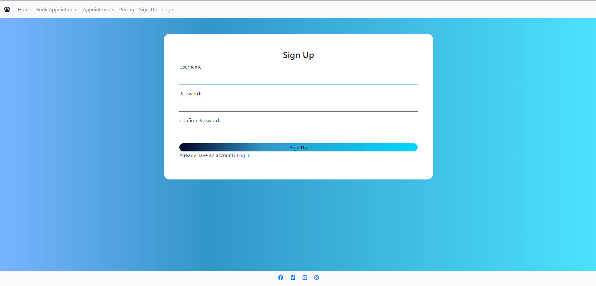

- My sign up page is very similar but with a few slight changes.

- It asks for the password twice to confirm.

- And it has a link to the log in page for already signed up users.

***

### Pricing 

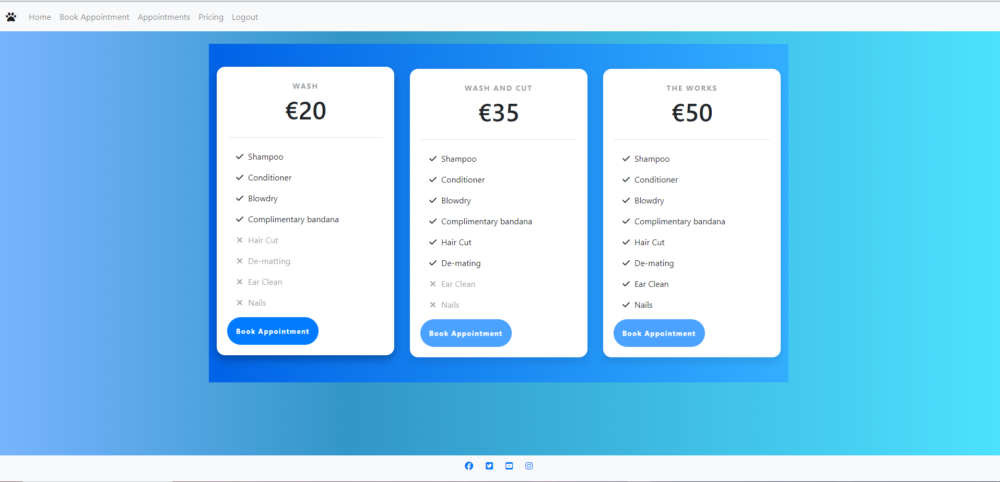

- My pricing page was again designed using bootstrap to help with responsiveness and ease of design.

- I used a tier based pricing I was really happy with how it turned out, it clearly shows what you get with each tier and also what you dont get.

[Back to top ⇧](#Bark-Avenue-Grooming)

***

## Technologies Used

### Languages Used

-[HTML5](https://en.wikipedia.org/wiki/HTML)
-[CSS3](https://en.wikipedia.org/wiki/CSS)
-[JavaScript](https://en.wikipedia.org/wiki/JavaScript)
-[Python](https://en.wikipedia.org/wiki/Python_(programming_language))

***

### Libraries and Frameworks

-[Django](https://www.djangoproject.com/)   
    -Django was used as web framework.

-[Django Template](https://jinja.palletsprojects.com)  
    -Django Template was used as a templating language for Django to display backend data to HTML.
   
-[Bootstrap 5](https://getbootstrap.com/docs/5.0/getting-started/introduction/)  
    -Bootstrap 5 was used throughout the website to help with styling and responsiveness.

-[Google Fonts](https://fonts.google.com)  
    -Google fonts were used to import the fonts into the html file and were used on all parts of the site.

-[Font Awesome](https://fontawesome.com)  
    -Font Awesome was used throughout the website to add icons for aesthetic and UX purposes. 

***

[Back to top ⇧](#Bark-Avenue-Grooming)

### Packages / Dependencies Installed

-[Django Allauth](https://django-allauth.readthedocs.io/en/latest/)  
    -Django Allauth was used for user authentication, registration, and account management.

-[Gunicorn](https://gunicorn.org/)  
    -Gunicorn was used as Python WSGI HTTP Server for UNIX to support the deployment of Django application.

-[Cloudinary](https://cloudinary.com/)
    -Cloudinary has been used as image management solution.

***

### Tools and Programs

-[GitPod](https://gitpod.io/)
     -GitPod was used for writing code, committing, and then pushing to GitHub.

-[GitHub](https://github.com)  
   GitHub was used to store the project's code after being pushed from Git. 

-[Heroku](https://www.heroku.com)   
    -Heroku was used to deploy the website.

-[Elephantsql](https://www.elephantsql.com)
    -Elephantsql was used to help host the Postgres database with Heroku.

-[Am I Responsive](ami.responsivedesign.is)  
    -Am I Responsive was used to preview the website across a variety of popular devices.

-[Chrome DevTools](https://developer.chrome.com/docs/devtools/)
    -Chrome DevTools was used during development process for code review and to test responsiveness.

-[W3C Markup Validator](https://validator.w3.org/)
    -W3C Markup Validator was used to validate the HTML code.

-[W3C CSS Validator](https://jigsaw.w3.org/css-validator/)
    -W3C CSS Validator was used to validate the CSS code.

-[JSHint](https://jshint.com/) 
    -The JSHints JavaScript Code Quality Tool was used to validate the site's JavaScript code.

-[Figma](https://www.figma.com)
    -Figma was used to make my wireframes.

[Back to top ⇧](#Bark-Avenue-Grooming)

***

## Testing

### Lighthouse

*** 

### Home Page

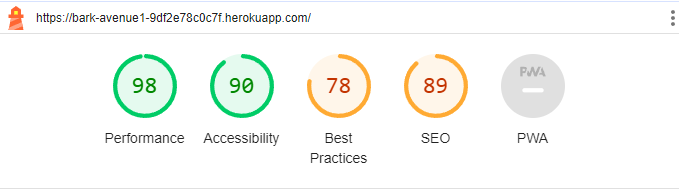

### Booking Page

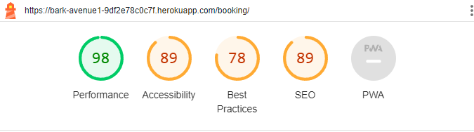

### Appointments Page

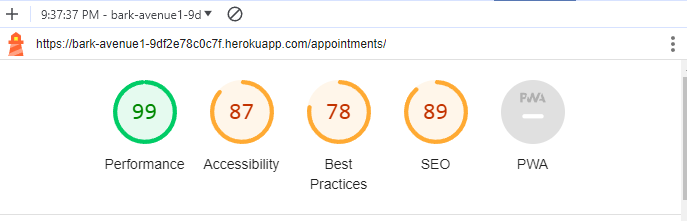

### Pricing Page

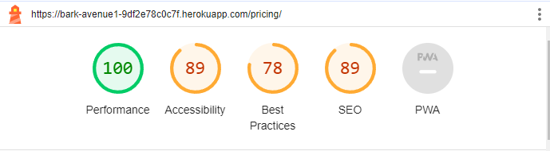

### Login Page

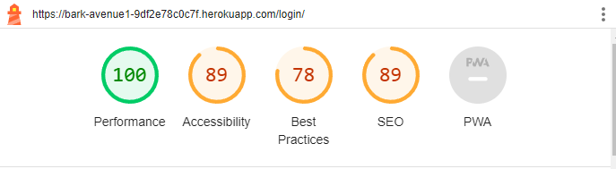

### Signup Page

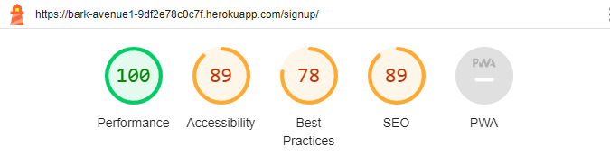

***

### Code Validtion

### HTML

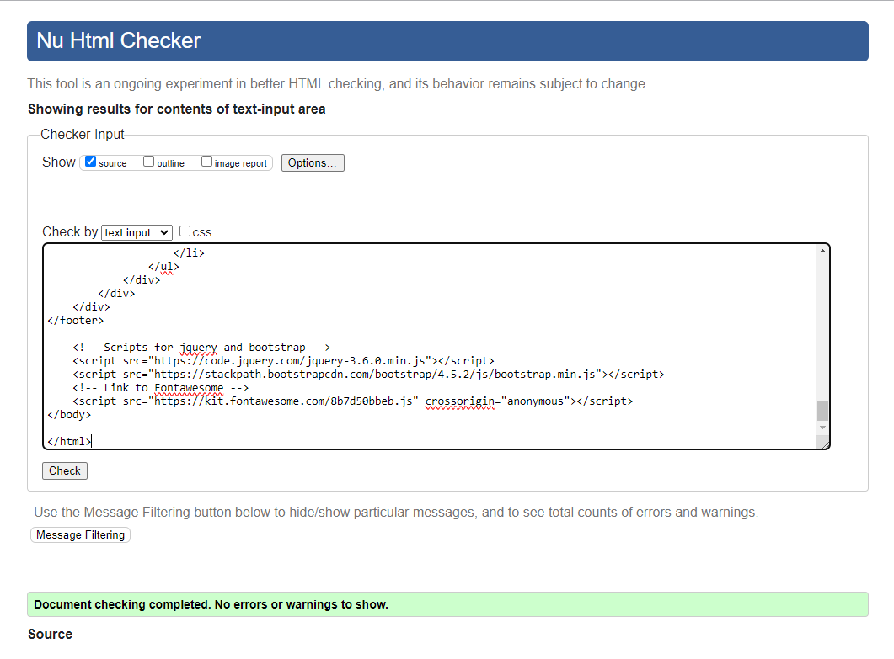

- All HTML pages were validated using [W3C Markup Validator](https://validator.w3.org/).

***

### CSS

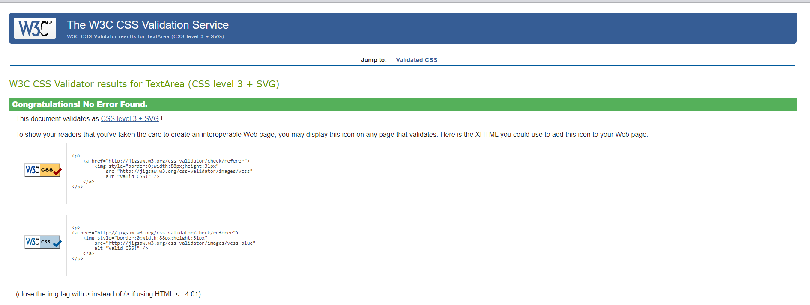

- My CSS was validated using [Jigsaw CSS Validator](https://jigsaw.w3.org/css-validator/)

### Javascript

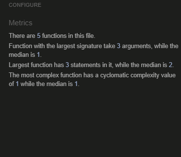

- My Javascript was validated using [JSHint](https://jshint.com/).

***

### Python 

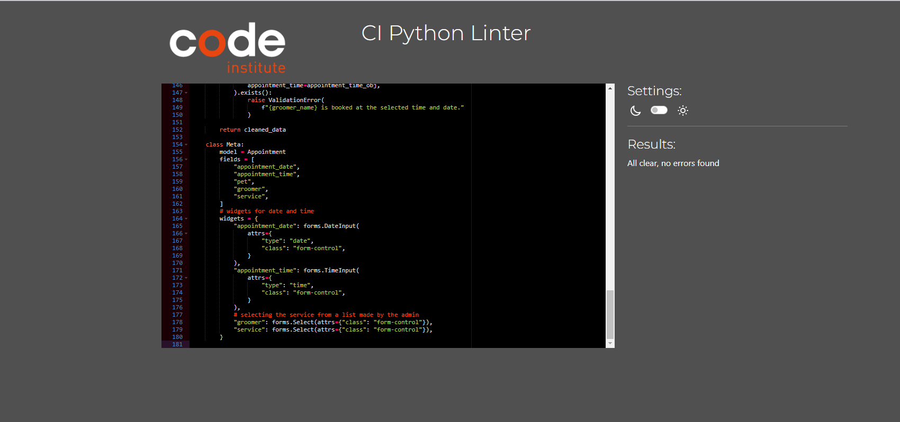

- The PEP8 tool provided by Code Institute was used to validate my python link to which is [here.](https://pep8ci.herokuapp.com/)

***

### Manual Testing

**Browser Compatibility**

Browser | Outcome | Pass/Fail  
--- | --- | ---
Google Chrome | No appearance, responsiveness or functionality issues.| Pass
Safari | No appearance, responsiveness or functionality issues. | Pass
Brave | No appearance, responsiveness or functionality issues. | Pass
Microsoft Edge | No appearance, responsiveness or functionality issues. | Pass

**Device compatibility**

Device | Outcome | Pass/Fail
--- | --- | ---
HP Pavillion 14" display | No appearance, responsiveness or functionality issues. | Pass
Custom Home PC with 28" display  | No appearance, responsiveness or functionality issues. | Pass
MSI Katana GF66 11UE | No appearance, responsiveness or functionality issues. | Pass
Iphone 14 Pro | No appearance, responsiveness or functionality issues. | Pass
Nothing Phone (1) | No appearance, responsiveness or functionality issues. | Pass
One Plus 8T| No appearance, responsiveness or functionality issues. | Pass

**Common Elements Testing**

- General

    Feature | Outcome | Pass/Fail
    --- | --- | ---
    Nav links |  Links are working as expected. | Pass
    Home booking button| Opens booking form as expected | Pass
    Booking links in pricing page | Opens booking form as expected | Pass
    Social Links | Open the specific website on a new tab. | Pass
    Booking form | Appears as expected and sends correct data to the database. | Pass
    Appointments Card | Showing all data and allowing editing and deletion. | Pass
    Login | Working as expected, login features being shown to user | Pass
    Sign up | Working as expected, and redirects user to login page | Pass
    Sign out | Working as expected, hides features for logged in users| Pass
    Appointment security | Working as expected, prevents other users from editing appointments not created by them. | Pass
    

###  Bugs

- I have dealt with lot's of bugs in the process of making this site.

- The biggest of which was actually the delete button, I spent around 2 days trying to get this to function correctly.

- At first it actually worked well but as it was technically a form it inherited the styling from all the other forms on the site. 
It had too much padding and I couldn't find a way to remove it.

- I thought I had a solution to this at one stage but I was then getting errors with post and get requests.

- It took a lot of online research but I ended up finding something very similar on a reddit page of all places.

- Even in the end I believe all these issues caused the problem with the appointment deleted successfully button, I had to use an alert which I'm not happy about.
    
[Back to top ⇧](#Bark-Avenue-Grooming)

***

## Deployment

To deploy this page to Heroku from its GitHub repository, the following steps were taken:

1. Create the Heroku App:
    * Select "Create new app" in Heroku.
    * Choose a name for your app and select the location.

2. Prepare the environment and settings.py file:
    * In the Settings tab, click on Reveal Config Vars and copy the url next to DATABASE_URL.
    * In your GitPod workspace, create an env.py file in the main directory. 
    * Add the DATABASE_URL value and your chosen SECRET_KEY value to the env.py file.
    * Add the SECRET_KEY value to the Config Vars in Heroku.
    * Update the settings.py file to import the env file and add the SECRETKEY and DATABASE_URL file paths.
    * Update the Config Vars with the Cloudinary url, adding into the settings.py file also.
    * In settings.py add the following sections:
        * Cloudinary to the INSTALLED_APPS list
        * STATICFILE_STORAGE
        * STATICFILES_DIRS
        * STATIC_ROOT
        * MEDIA_URL
        * DEFAULT_FILE_STORAGE
        * TEMPLATES_DIR
        * Update DIRS in TEMPLATES with TEMPLATES_DIR
        * Update ALLOWED_HOSTS with ['app_name.heroku.com', 'localhost']

3. Store Static and Media files in Cloudinary and Deploy to Heroku:
    * Create three directories in the main directory; media, static and templates.
    * Create a file named "Procfile" in the main directory and add the following:
        * web: gunicorn project-name.wsgi
    * Go to the Deploy tab on Heroku and connect to GitHub, then to the required repository.
    Click on the Deploy Branch and wait for the build to load. When the build is complete, the app can be opened through Heroku.

[Back to top ⇧](#Bark-Avenue-Grooming)

## Finished Product

| Page        | Desktop         | Mobile |
|-------------|------------------|------------------|
| Home        |  | 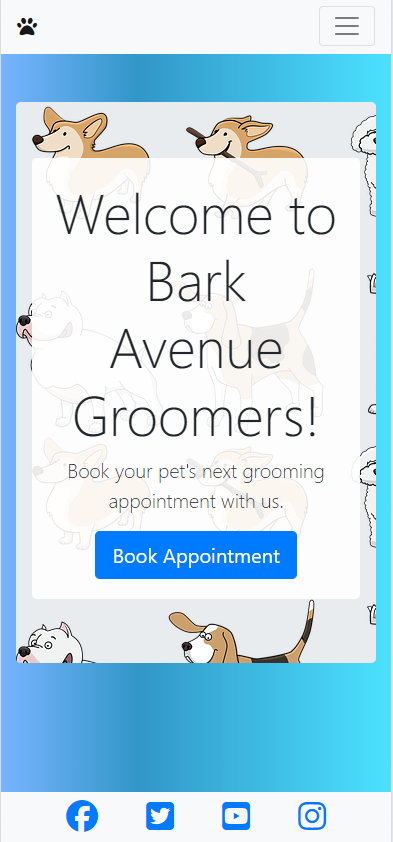 |
| Booking     |  | 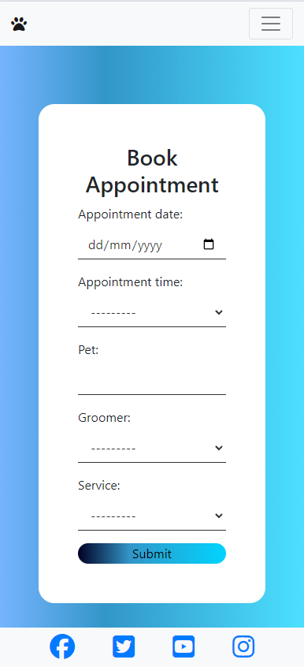   |
| Pricing     |  | 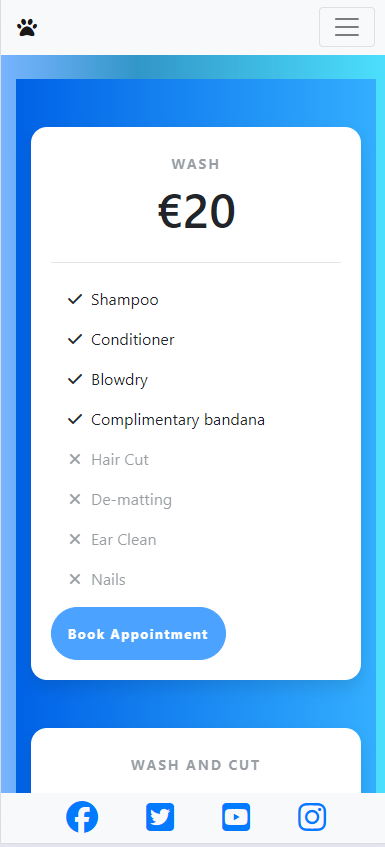   |
| Appointments| |  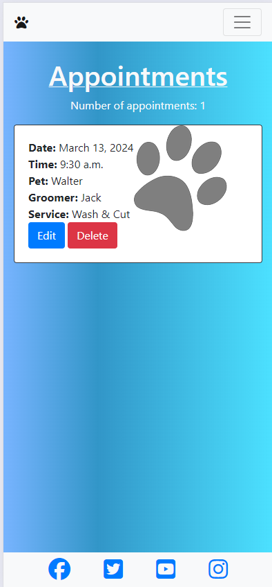  |
| Login       |  | 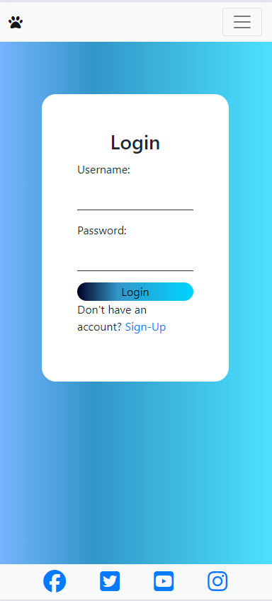    |
| Sign Up     |  |  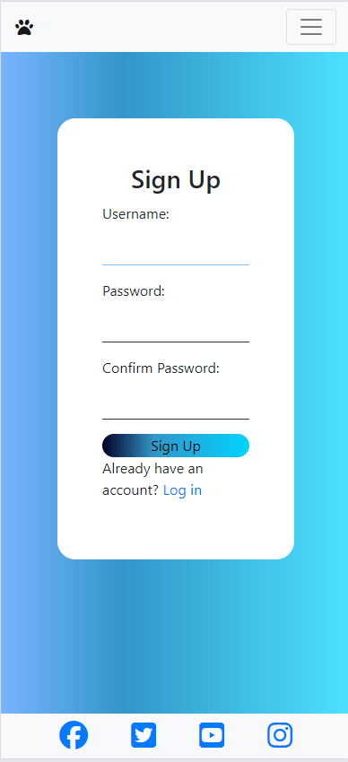   |

***

## Credits

- I'd actually like to credit my mom for inspiring this site and for helping with the details.

- Inspiration was taken various users from [Youtube](https://www.youtube.com/).

- I used [giphy.com](https://giphy.com/gifs/dog-face-front-camera-7XuKKmGiaxXe6EjOj4) for the dog gif on the page for appointment security.

***

## Acknowledgements

- Everyone in the Code Institute Slack community.

- My mentor Marcel, for his fantastic feeback and for breaking this down and making it seem possible for me.

- My family, for allowing me some time to myself to complete this.

[Back to top ⇧](#Bark-Avenue-Grooming)

