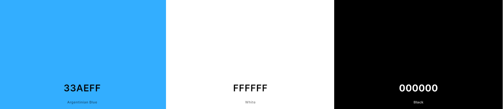

# Bark Avenue Grooming

I decided to create a booking site for Bark Avenue Grooming because I wanted to challenge myself and step out of my comfort zone. The walkthroughs we had in the course were a blog post and a simple to-do list, so I didn't want to completely replicate them. I did take elements from both, though; the blog post walkthrough was particularly helpful for setting up this project. However, I aimed for this site to be mostly my own. Interestingly, my mom actually runs a grooming business by the same name, so I leaned on her for help with some of the smaller details. In this README, I'll delve into the full process of creating this site and discuss possible features I may want to add in the future.

View the deployed website [here]().

## Table of Contents

1. [User Experience (UX)](#user-experience-ux)
    1. [Project Goals](#project-goals)
    2. [User Goals](#user-goals)
    3. [Goals Table](#goals-table)
    4. [Color Scheme](#color-Scheme)
    5. [Wireframes](#wireframes)
2. [Features](#features)
    1. [General](#general)
    2. [Home Page](#home-page)
    3. [Profile](#profile)
    4. [Our Houses](#our-houses)
    5. [Admin](#admin)
3. [Technologies Used](#technologies-used)
    1. [Languages Used](#languages-used)
    2. [Libraries and Frameworks](#languages-and-frameworks)
    3. [Packages / Dependencies Installed](#packages--dependencies-installed)
    4. [Database Management](#database-management)
    5. [Tools and Programs](#tools-and-programs)
4. [Testing](#testing)
    1. [Go to TESTING.md](https://github.com/josswe26/code-buddy/blob/main/TESTING.md#code-buddy-testing)
5. [Deployment](#deployment)
6. [Finished Product](#finished-product)
7. [Credits](#credits)
8. [Known Bugs](#known-bugs)
9. [Acknowledgements](#acknowledgements)

## User Experience (UX)

#### Project Goals

- The website contains simple colours for a clean look and also to not draw attention from the content.

- Responsive design to make the website accessible on different screen sizes.

- Easy to read understand and navigate the site.

- Make it easy for users to sign up or login into the site.

- Have a simple booking form that sends the results to the database I setup.

- A page to view , edit and delete appointments. (CRUD)

#### User Goals

- As an Admin, I want to manage the site content.

- As a User, I want the information to be easy to find and read.

- As a User, I want to be able to book an appointment.

- As a User, I want to be able to view , edit and delete my appointments.

- As a User, I want to see the prices of the available services.

#### Goals Table

Goal | Achieved? |
--- | --- | 
User sign up/login| Yes |
Make an appointment | Yes  |
View and edit appointments |Yes |
Avoid double bookings for groomers | Yes |
Contact details / social links | Yes |
View prices | Yes |
Have a responsive design |  Yes |

### Color Scheme

For my previous web pages I had something to take the color from that had to do with the theme.
This time there's no history involved I tried to keep it simple Black and White with a splash of Color.
And I chose the light blue as the splash because it's my mom's favourite color and she inspired this site.

### Wireframes

For my wireframes i used to use balsamiq but my free trail actually ran out, so this time around I'm using [Figma](https://www.figma.com/),
It's not what I'm used to but it still gave me the help I needed to visually plan out most of this project.

Page | Wireframe
--- | --- 
Home |  |
Booking|  |
Login / Logout |  |
Appointments |  |

[Back to top ⇧](#Bark-Avenue-Grooming)

## Features

### General

### Navbar

- I used a simple navbar for this project just basic white background with simple text and the companys logo.

- I mostly just wanted the navbar to be responsive at all screen sizes.

- So I used Bootstrap to make this navbar, at smaller screens it turns the links into a hamburger icon for ease of use and a cleaner design.

### Call to action

- Again the design for this is pretty simple, it has a clear function. It tells the user the name of the company and gives them a button to where they can go straight to the booking form.

- I added the background image to make the home page seem a bit more fun and add some life to it.

### Footer

- The footer of this site just contains the social media links, when the user hovers over said icon it changes color to a color associated with that site.

